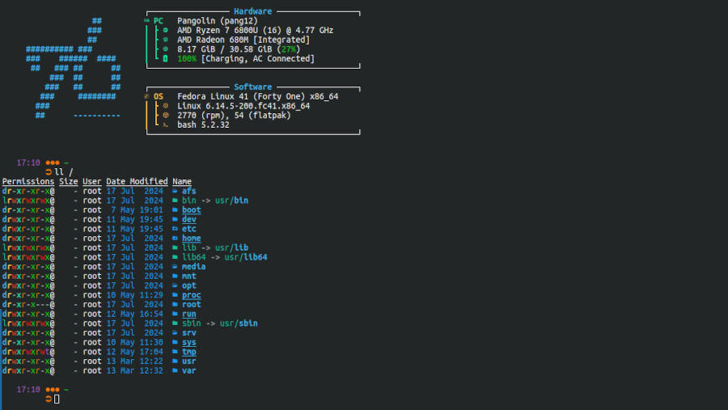

# Ubiozur's Dotfiles
<p align="center"></p>

## Introduction

This repository serve as my storage or my linux config files (aka dotfiles). It makes it easy to setup my systems, headless or workstation, with a common configuration for the softwares.

Feel free to explore, learn and copy parts for your own dotfiles. Enjoy!

## Applications

The configurations are for multiples applications I use all the time.

* **BASH** [dotfiles](./bash/readme.md) configure my bash and terminal setup.
* **fastfetch** [dotfiles](./fastfetch/readme.md) configure fastfetch to my need.
* **fonts** [dotfiles](./fonts/readme.md) install fonts I use on my systems.
* **wget** [dotfiles](./wget/readme.md) move wget files away from the home folder.

## Install the dotfiles

To install the dotfiles, clone the repository and use the [makefile](./makefile) and `make` command to install them.

1. Clone the repository

   * For *read*/*write* to the repository, clone using ssh.

   ```bash
   git clone git@github.com:ubiozur/dotfiles.git ~/github/dotfiles && cd ~/github/dotfiles
   ```

   * For *read only* of the repository, clone using https.

   ```bash
   git clone --depth=1 https://github.com/UbioZur/dotfiles.git ~/dotfiles && cd ~/dotfiles
   ```

2. Run the make file to copy/install the dotfiles.

   > [!CAUTION]
   > Your original files/folders **will be deleted** without prompt or backup! Make sure to make your own backup first!

   * For a workstation (desktop linux), install every dotfiles.

   ```bash
   make all
   ```

   * For an headless installation (server), install only the CLI, and setup a cron job for automatic update.

   ```bash
   make headless cron
   ```

## Update the dotfiles

The dotfiles are a copy and not a symlink of the repository! To update the files after a `git pull` you will want to run the update command.

> [!CAUTION]
> Any change made to the dotfiles **will be deleted** without prompt or backup! It is designed to get the files changed from the repository and not the files themselves!

* Update the repository and file manually.

   ```bash
   git pull && make update
   ```

* Update the repository and files automatically (cron job at 12:00 daily)

   ```bash
   make cron
   ```

## Makefile Usage

The [makefile](./makefile) has multiple targets to help with some tasks. You can check the latest options with `make help`.

```
Dotfiles Makefile

Usage: make [OPTIONS]

Options to install dotfiles
  all:       (DEFAULT) Install/Copy all the dotfiles.
  headless:  Install/copy dotfiles for headless systems
  cron:      Add a cronjob dayly at 12:00 to update the git and dotfiles.

Standalone options to manage installed dotfiles
  update:    Update the already installed dotfiles.
  clean:     Remove the cronjob and directories.lock file.

Extra Options to help development
  debug:     Print some debug information.
```
